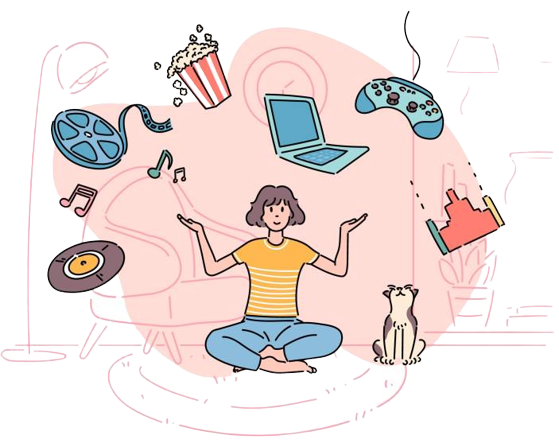

 
  

<h1 align="center"> Alan Repository </h1>
<h3 align="center"> This is my first and own repository </h3>  

 

 
  

<!-- TABLE OF CONTENTS -->
<h2 id="table-of-contents"> :book: Table of Contents</h2>

  
Contenidos

  <ol>
    <li><a href="https://github.com/up210305/UP210305_CPP/tree/main/U1"> ➤ U1</a></li>
    <li><a href="https://github.com/up210305/UP210305_CPP/tree/main/U2"> ➤ U2</a></li>
    <li><a href="https://github.com/up210305/UP210305_CPP/tree/main/U3"> ➤ U3</a></li>
    <li><a href="https://github.com/up210305/UP210305_CPP/tree/main/U4"> ➤ U4</a></li>
    <li><a href="#roadmap"> ➤ Others</a></li>
    <!--<li>
      <a href="#preprocessing"> ➤ Preprocessing</a>
      <ul>
        <li><a href="#preprocessed-data">Pre-processed data</a></li>
        <li><a href="#statistical-feature">Statistical feature</a></li>
        <li><a href="#topological-feature">Topological feature</a></li>
      </ul>
    </li>-->
    <!--<li><a href="#experiments">Experiments</a></li>
    <li><a href="#results-and-discussion"> ➤ Results and Discussion</a></li>
    <li><a href="#references"> ➤ References</a></li>
    <li><a href="#contributors"> ➤ Contributors</a></li>-->
  </ol>

<!-- ABOUT THE PROJECT -->
<h2 id="about-the-project"> :pencil: About the repository</h2>

 
  This repository is made as a simple presentation, a way to organize and for the teacher to be able to evaluate the different programs that we carry out throughout the course.

          
  <!--<figcaption>Caption goes here</figcaption>-->

<!-- PREREQUISITES -->
<h2 id="prerequisites"> :fork_and_knife: Hobbies</h2>
<!--
  
  
-->
<!--This project is written in Python programming language.  -->
Hobbies:
* Read manga
* Watch movies and series
* Llisten to music
* Play videogames
* Read books

          
  <!--<figcaption>Caption goes here</figcaption>-->

