<h1 align="center"> Contents</h1>
  
### Exercise 1: A program that asks the user for his annual rent and displays the corresponding tax.
<details close="open" >
  <summary>Details</summary>


```c++
    //Request for rent
    cout << "What is your annual rent? ";
    cin >> renta;

    //Comparison of rent with conditions
    if (renta<10000)
    { 
        declarar(renta, 5, .05);
    }
    else if (renta>=10000 & renta <20000)
    {
        declarar(renta, 15, .15);
    }
    else if (renta>=20000 & renta <35000)
    {

        declarar(renta, 20, .20);
    }
    else if (renta>=35000 & renta <60000)
    {
        declarar(renta, 30, .30);
    }
    else if (renta>=60000)
    {
        declarar(renta, 45, .45);
    }

    //Function with the visualization with the amount of tax to pay
    void declarar(float cantidad, float porcentaje, float rentaInteres){
    
        float interes;
    
        interes = cantidad*rentaInteres;
        rentaInteres = (interes/cantidad)*100;
        cout<< "Your tax is "<< rentaInteres << "%" <<endl;
        cout << "Tax to pay " << interes;
    }

```
## Explanation of the exercise 1
>__1.__ Ask the user for his annual rent.
__2.__ If the anual rent is less than $10,000 it's 5%.
__3.__ If the anual rent is between $10,000 and $20,000 it's 15%.
__4.__ If the anual rent is between $20,000 and $35,000 it's 20%.
__5.__ If the anual rent is between $35,000 and $60,000 it's 30%.
__6.__ If the anual rent is more than $60,000 it's 45%.
__7.__ Print the porcent of tax and the tax to pay.

## Test

### A) Less than $10,000
<p align="justify"> 

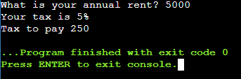

</p>


### B) Between $10,000-$20,000

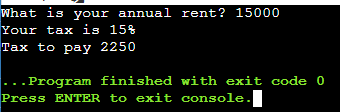

### B) Between $20,000-$35,000

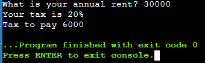

### B) More than $60,000
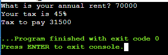

</details>

### Exercise 2: A program that asks the user for his score and displays the corresponding type of benefit and money.

<details close="open">
  <summary>Details</summary>


```c++
    //Ask the puntuation of the user
    cout << "What is your puntuation? " << endl;
    cin >> puntuacion;

    //Evaluate the score to assign the level and money.
    if((puntuacion==0.0)||(puntuacion==0.4)||(puntuacion>=0.6)){
        dinero = puntuacion*2400;
        if(puntuacion==0.0)
        {
            cout << "Your level of performance is unacceptable" << endl;
        
        }else if (puntuacion==0.4)
        {
            cout << "Your level of performance is acceptable" << endl;
        }else if (puntuacion>=0.6)
        {
            cout << "Your level of performance is meritorious" << endl;
        }
        cout << "The money you will get is $" << dinero << endl;
        
    }else{
        cout << "The performance you enter is invalid";
    }

```

### Explanation of the exercise 2
>__1.__ Ask the puntuation of the user.
__2.__ Check that the user entered a score more than or equal to 0.6 or equal to 0.4 or equal to 0.0
__3.__ If the user does not enter a valid score print Your score is unacceptable message.
__4.__ Multiply the score by 2400 and get the cash value.
__5.__ Check what kind of score you got depending on your performance
__6.__ Print the amount of money.

## Test

### A) Puntuation 0.0
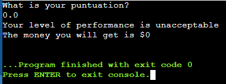

### B) Puntuation 0.4
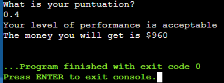

### C) Puntuation 0.6
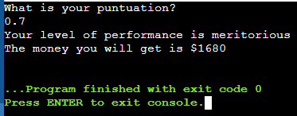

</details>

### Exercise 3: A program that asks for your age and print the cost of ticked.

<details close="open">
  <summary>Details</summary>


```c++
    // Enter your age 
    cout << "How old are you? " << endl;
    cin >> edad;

    //Asignate the cost of your ticked
    if (edad>=0 && edad<4)
    {
        cout << "You can enter for free" << endl;
    }
    else if (edad>=4 && edad<=18)
    {
        cout << "You can enter for $5 bucks" << endl;
    }
    else if (edad>18)
    {
        cout << "You can enter for $10 bucks" << endl;
    }
    else
    {
        cout << "Your age is invalid \n";
    }

    // Print the cost of the ticked.
    cout << "The cost of your ticked is $" << precio << endl;
```

### Explanation of the exercise 3
>__1.__ Ask the age of the user.
__2.__ If the age is between 4 and 0, the ticket price is 0 bucks.  
__3.__ If the age is more than 4 and less than 18, the ticket price is 5 bucks.  
__4.__ If the age is more than 18, the ticket price is 10 bucks.
__5.__ If the age lower than 0, you will see a message "Your age is invalid".  
__6.__ Print the ticket cost. 

## Test

### A) Below 4
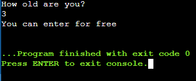

### B) More than 4 and less than 18
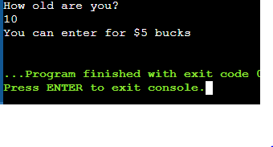

### C) More than 18
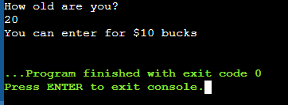

### D) Invalid age
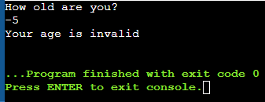
</details>

### Exercise 4: Menu of a restaurant called Bella Napoli Pizzeria showing your type of pizza and the ingredients it has.

<details close="open">
  <summary>Details</summary>

```c++

    //Menu of the Bella Napoli
    cout << "Menu\n" << endl;
    cout << "1. Vegetarian Pizza" << endl;
    cout << "2. Classic Pizza" << endl; 

    //Ask the pizza user want
    cout << "What pizza do you want? ";
    cin >>pizza;

    //Ingredients of vegetarian pizza
    if (pizza==1)
    {
        cout << "Ingredients\n"<< endl;
        cout << "1. Pepper" << endl;
        cout << "2. Tofu" << endl;
        cout << "3. Exit\n" << endl;

        cout << "Enter the ingredient do you want? ";
        cin >> opcion;
        if (opcion==1)
        {
            cout << "Your pizza is vegetarian with tofu and tomatoe sauce";
        }
        else if (opcion==2)
        {
            cout << "Your pizza is vegetarian with tofu and tomatoe sauce";
        }
        else if (opcion==3)
        {
            system("PAUSE");
        }
        else{
            cout << "Your ingredient is invalid";
        }
        
    }

    //Ingredients of vegetarian pizza
    else if (pizza==2)
    {
        cout << "Ingredients\n"<< endl;
        cout << "1. Peperoni" << endl;
        cout << "2. Jam" << endl;
        cout << "3. Salmon" << endl;
        cout << "4. Exit\n" << endl;

        cout << "Enter the ingredient do you want"<< endl;
        cin >> opcion;
        if (opcion==1)
        {
            cout << "Your pizza is classic with peperoni, mozzarella and tomatoe sauce";
        }
        else if (opcion==2)
        {
            cout << "Your pizza is classic with jam, mozzarella and tomatoe sauce";
        }
        else if (opcion==3)
        {
            cout << "Your pizza is classic with salmon, mozzarella and tomatoe sauce";
        }
        else if (opcion==4)
        {
            system("PAUSE");
        }
        else{
            cout << "Your ingredient is invalid";
        }

    }
    //Invalid pizza
    else{
        cout << "Your pizza is invalid";
    }

```

### Explanation of the exercise 4
>__1.__ Ask the user what type of pizza user prefers. 
__2.__ Display the menu depending on your type of pizza.
__3.__ If he selects 1 he enters the vegetarian ingredients menu.  
__4.__ If he selects 2 he enters the no vegetarian ingredients menu. 
__5.__ If any number but 1 or 2 is selected it prints "Your pizza is invalid".   
__6.__ Ask what ingredients you want on your pizza.
__7.__ Print the type of your pizza and the ingredients it has.

## Test

### A) Vegetarian pepper
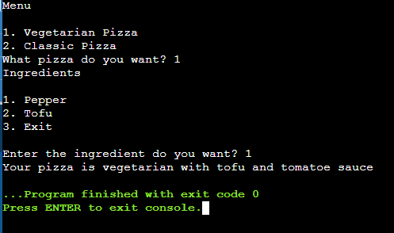

### B) Vegetarian tofu
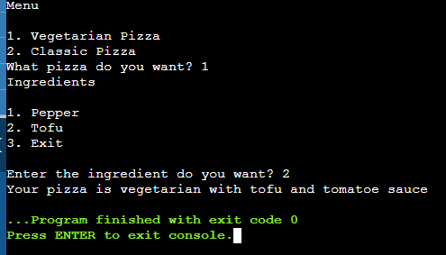

### C) Pizza pepperoni
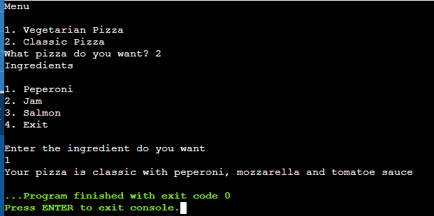

### D) Pizza salmon
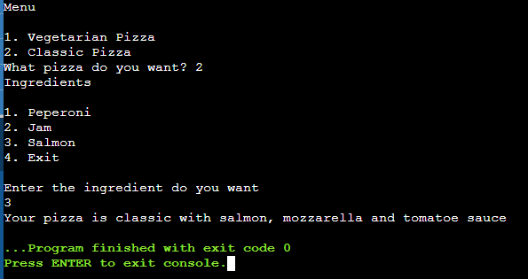

</details>

### Exercise 5: Make a program in which 6 temperatures are entered and determine the average, the most low and the highest.

<details close="open">
  <summary>Details</summary>


```c++

int main(){
    float temperatura;
    int contador = 1;
    float tempeAcum = 0;
    int temperatura_min = 9999, temperatura_max = -9999;

    do
    {
        cout << "Give me the temperature?" << endl;
        cin >> temperatura;
        tempeAcum +=temperatura;

        contador ++;
        if (temperatura <= temperatura_min)
        {
            temperatura_min=temperatura;
        }
        if (temperatura >= temperatura_max)
        {
            temperatura_max=temperatura;
        }
    } while (contador <=6);
    
    cout << "The average of temperature today is : " << tempeAcum/6 <<endl;
    cout << "The least temperature is " << temperatura_min<< endl;
    cout << "The maximun temperature is " << temperatura_max << endl;


    return 0;
}

```
### Explanation of the exercise 5
>__1.__ Ask the user a temperature. 
__2.__ Compare the temperatures you enter.
__3.__ Print the average of temperature today.  
__4.__ Print the least temperature. 
__5.__ Print the maximun temperature.   

## Test

### A) Same temperature
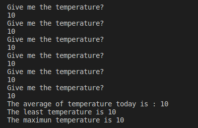

### B) Differents temperatures
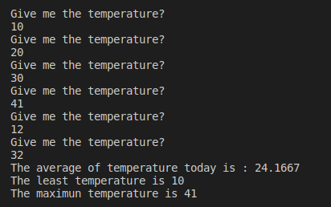

### C) Negative temperatures
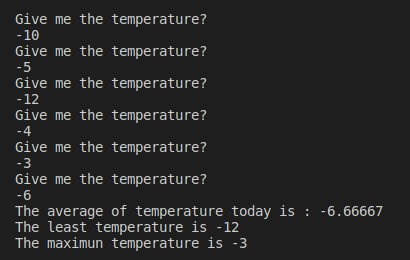
</details>

### Exercise 6: Make a program that reads indefinitely quantities of products and their price, and at the end indicate the total of the invoice.

<details close="open">
  <summary>Details</summary>


```c++

int main(){

    int producto=1;
    float precio;
    float total = 0;
    do
    {
        
        cout << "Enter the amount of products: ";
        cin >> producto;
        
        if (producto!=0 & producto>0)
        {
            cout << "Enter the price of the product: ";
            cin >> precio;

            total += producto*precio;
        }
        
        

    } while (producto > 0 & precio>=0);
    cout << "The bill is: \n";
    cout << "Total account is: " << total << "\n";
    
}

```
### Explanation of the exercise 6
>__1.__ Enter the amounts of products. 
__2.__ Enter the price of the product
__3.__ Make an operation of the quantity of product and its price.  
__4.__ Print the bill. 
__5.__ Print the totalo account.   

## Test

### A) One product
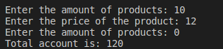

### B) Differents products
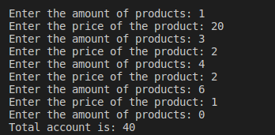
</details>

### Exercise 7: Write a program that performs the conversion from decimal to binary, only for integers greater than 0.

<details close="open">
  <summary>Details</summary>

```c++

int main(){
    string resultado;
    int numero;

    cout << "Enter the number you want to convert to binary? ";
    cin >> numero;
    while (numero != 0)
    {
        resultado = (numero%2==0)? "0" + resultado: "1" + resultado;
        numero/=2;
        
    }
    cout << "Your number in binary is " << resultado<< "\n";
    
}

```
### Explanation of the exercise 7
>__1.__ Enter the number you want to convert to binary. 
__2.__ Print the number in binary.
   

## Test

### A) Number 12
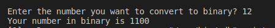

### B) Number 50
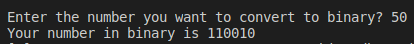

</details>

### Exercise 8: Tables of multiplication.

<details close="open">
  <summary>Details</summary>

```c++

int main(){

    int numero;
    int tabla;

    cout<<"What number do you want your table?"<<endl;
    cin>>tabla;

    cout<<"Until what number do you want your table?"<<endl;
    cin>>numero;
    cout<<"\n";
    for (int i = 0; i <= numero; i++)
    {
        
        cout<<"|";
        for (int j = 0; j <= 38; j++)
        {
            cout<<"-";
            

        }
        cout<<"|\t";

        cout<<"\n";

        cout<<"|\t"<<i<<"    X    "<<tabla<<"    =    "<<tabla*i<<"    \t|"<<endl;

        
    }
    
}

```
### Explanation of the exercise 8
>__1.__ Enter the number you want your table. 
__2.__ Enter the number until you want your table.
__3.__ Print a table of multiplication.

## Test

### A) Table of 5
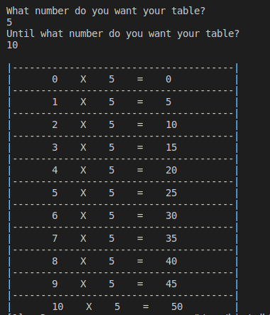

### B) Table of 50
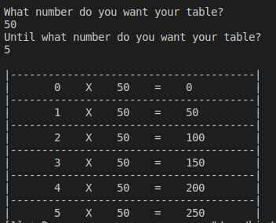
</details>

### Exercise 9: Bisection method.

<details close="open">
  <summary>Details</summary>

```c++

int main(){

    float resolver(float num)
{
    return (pow(num, 2) - num - 12);
}

int imprimir()
{
    for (int i = 0; i < 161; i++)
    {
        cout << "-";
    }
    cout << "\n";
    return 0;
}

int main()
{   

    int interador = 1;
    int sol = 1;
    float margen = 0.00001;
    float a, b, c, ya, yb, yc;

    cout << "Type the value A: ";
    cin >> a;
    cout << "Type the value B: ";
    cin >> b;

    imprimir();
    cout << "| Interdor \t| a \t\t\t| b \t\t\t| c \t\t\t| y(a)\t\t\t| y(b)\t\t\t| y(c)\t\t\t| \n";
    imprimir();

    do
    {
        c = (a + b) / 2;
        ya = resolver(a);
        yb = resolver(b);
        yc = resolver(c);

        cout << "| " << interador << "\t\t| " << fixed << setprecision(8) << a << "\t\t| " << b << "\t\t| " << c << "\t\t| " << ya << "\t\t| " << yb << "\t\t| " << yc << "\t\t| \n";
        imprimir();

        if ((ya * yc) < 0)
        {
            b = c;
        }
        else {
            a=c;
        }
        if (a==b){
            sol = 0;
            break;
        }
        
        interador++;
    } while ( abs(yc)>= margen);

    if (sol != 0)
    {
        cout << "The root is :" << c;
        cout << "\n";
    }
    else
    {
        cout << "There is no root in that range. \n";
    }
    return 0;

    system("Color E4");

}

```
### Explanation of the exercise 9
>__1.__ Enter the valuye of A and B. 
__2.__ Get the value of C.
__3.__ Get the y-values when its value is a, b and c.
__4.__ Print the table of bisection method.
__5.__ Print the root.

## Test

### A) 1-9
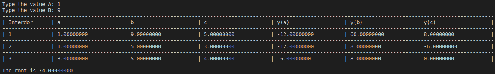

### B) 1-12
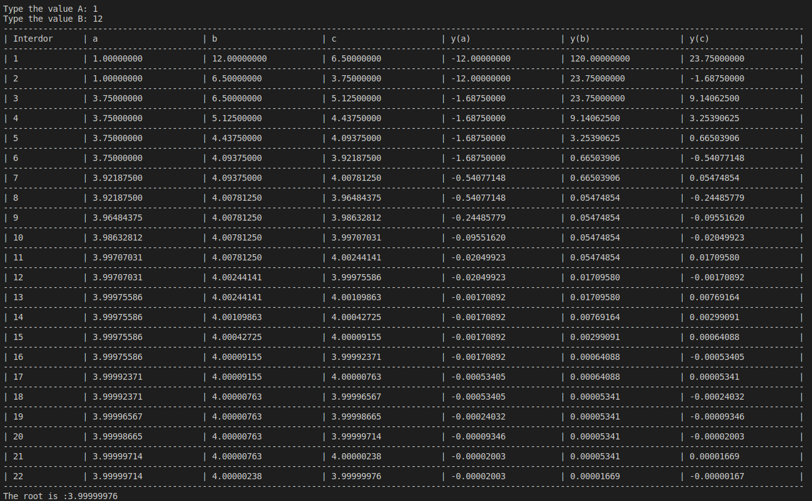
</details>
