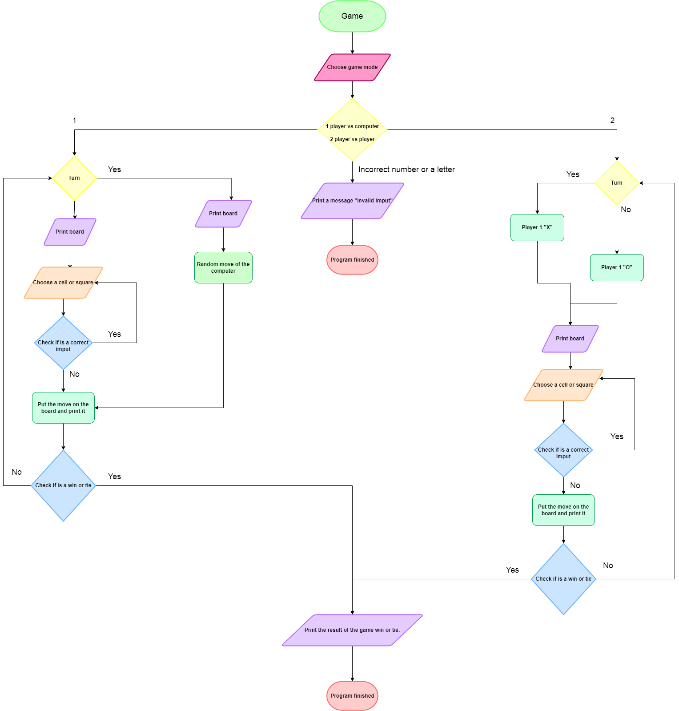
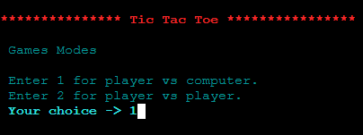
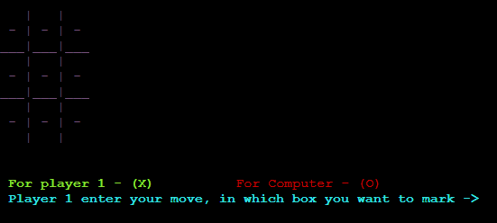
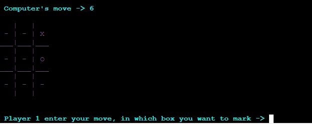
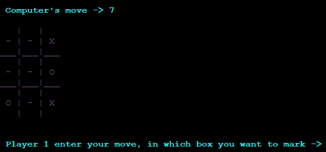
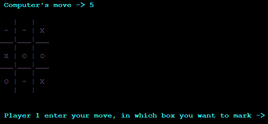
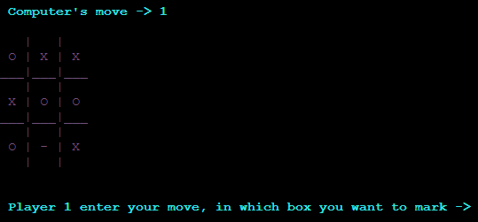
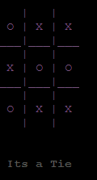

<h1 align="center"> Tic Tac Toe</h1>

##  __📌&nbsp;Index__

[Explanation of the game](#game)   
[Instructions for execution and use](#instructions-for-execution-and-use)   
[Flowchart](#flowchart)   
[Tests of the game](#-tests)   
[Conclusion](#conclusion)

##  __🎲&nbsp;Explanation of the Game__

It's a C++ game, it has 2 modes of playing whether player vs player or player vs computer. For 2 players mode it will directly take the input from users on which position they want to mark and directly add their mark in the game sheet. For 1 player vs Computer mode it will take input from user and for computer turn it will use a random function and will check wheather the number is repeated or not, if repeated it will call the random function again and take new value as the computer mark.

## __📓&nbsp;Instructions for execution and use__

[Index](#index)

In order to enjoy the single player and multiplayer game modes, you first need to follow the steps below depending on the operating system.
<h2> Windox </h2>

1. Download or clone my repo with the following command in the terminal:
   
~~~
git clone https://github.com/UP210052/UP210052_CPP.git mi repo
~~~

2. Download and install the compiler in this link https://sourceforge.net/projects/mingw/files/OldFiles/ 

3. Open the terminal at the direction of the file with the command:

~~~
cd C:\Documents\...
~~~

4. To compile use command:

~~~
gcc  04_Gato.cpp -o 04_Gato.exe
~~~

5. To run type this code:

~~~
04_Gato.exe
~~~

<h2> Linux (Ubuntu)</h2>

1. Download or clone my repo with the following command in the terminal:
   
~~~
"git clone https://github.com/UP210052/UP210052_CPP.git"
~~~

2. Install GNU c/c++ compiler, open the terminal and type:

~~~
$ sudo apt-get update
$ sudo apt-get install build-essential manpages-dev
~~~

3. To compile this program, type:

~~~
gcc 04_Gato.c -o 04_Gato
~~~

4. To run this program, type:
   
~~~
./04_Gato
~~~

[Index](#index)

## __🌐&nbsp;Flowchart__

[Index](#index)

## __🎮&nbsp;Tests of the game__

<h2>Things to consider</h2>

- Don't write numbers with decimal point or letters when the game ask you for a move in the board.  
- You can't choose which figure you want beetween "X" and "O".
- In single player mode the player is "X" and the computer is "O".  
- In multiplayer mode, player 1 is "X" and player two is "O".

<h2 align="center"> Player vs Computer</h2>

First, the program shows you a menu with the existing game modes that you can play. 

After selecting the first option, a board will appear where we can enter the moves. 

Then a game will start. First the player starts on square 3 while the computer made a random move on square 6.

Then on my second move I chose square 9 and the computer answered with square 7.  

After that i decided to choose cell number 4 while the computer chose cell 5.

My fourth move is in cell 2. The computer counters by putting their move in cell 1 to prevent me from winning.  

As there were only 2 squares left at the end and it was impossible for the player or the computer to win, it ended in a draw.

[Index](#index)

##  __📝&nbsp;Conclusion__

I think that this project was complicated in several very important aspects that had to be implicit in the program for it to go well. The project became difficult for me each time we advanced, for example at the beginning I had complications with the board, how to create and develop it, another difficult point was the use of matrices in the code that I still do not understand 100 percent.
The most complicated part was the implementation of the artificial intelligence function for the "player vs computer" mode, because although I could imagine how I could do it in my mind, I couldn't get my thoughts into a functional code for the artificial intelligence.
Finally the front-end part was the easiest because you can't do much maybe more than add colors, but I would have liked to learn and investigate more decoration tools to make the front-end display cleaner, more organized and colorful. 

[Index](#index)
