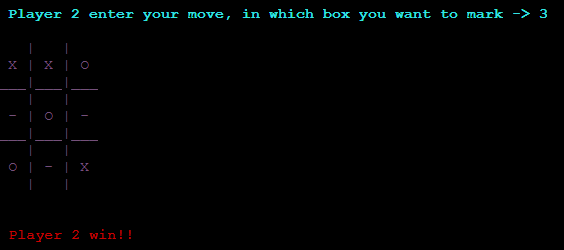

<h1 align="center"> Content</h1>

### Game: A program that you can play tic tac toe called in spanish "gato". In this game you can choose to play in two modes player vs computer or player vs player.

<details open="closed" >

```c++
#include<iostream>
#include<conio.h>
#include<stdlib.h>
using namespace std;

char square[9];
void print_board();
int check_win();
int computer_mark();

int main()
{

    int choice, mark, p, q, r, k, j=1, win=0, mark_2;

    cout<<"\033[1;31m"<<"*************** Tic Tac Toe ****************\n\n";
     
    cout<<"\033[0;36m"<<" Games Modes \n\n Enter 1 for player vs computer. \n Enter 2 for player vs player." << "\033[1;36m"<< "\n Your choice -> ";             //Enter number of player.
    cin>>choice;
     
	for(k=1;k<=9; k++)                                                                   
    { 
        square[k] = '-';
    }
    print_board();
    
        if(choice == 2)                                                                    //For 2 player
            {
                cout<<"\033[1;32m"<<" \n For player 1 - (X)       "<< "\033[0;31m"<< "   For player 2 - (O)";
  
                while(win == 0)
                {
                    cout<< "\033[1;36m"<<"\n Player 1 enter your move, in which box you want to mark -> ";        //Player1 move
                    cin>>mark;
                    square[mark] = 'X';
                    print_board();
                     
                    win = check_win();
    	                if (win==1)
                        {
                           cout<<"\033[1;32m"<<"\n Player 1 win!!";
                           exit(0);
                        }
                        else if (win==2)
                        {
                            cout<<"\033[1;30m"<<"\n Its a tie!!";
                            exit(0);
                        }
           
                        cout<< "\033[1;36m"<<"\n Player 2 enter your move, in which box you want to mark -> ";        //Player 2 move
                        cin>>mark;
                        square[mark] = 'O' ;
                        print_board();
                            
                        win = check_win();   
	     			    if (win==1)
                        {
                            cout<< "\033[0;31m"<<"\n Player 2 win!!";
                            exit(0);
                        }
                }
           }
     
	else if(choice==1)                                                                      // For 1 player game
    {
        cout<<"\033[1;32m"<<" \n For player 1 - (X)       "<< "\033[0;31m"<< "   For Computer - (O)";
         
		    while(win ==0)
            {
                cout<< "\033[1;36m"<<"\n Player 1 enter your move, in which box you want to mark -> ";           //Player move
                cin>>mark;
                   
                square[mark] = 'X' ;
                j++;
                print_board();
                  
                win = check_win();
			        if(win==1)
                    {
                        cout<<"\033[1;32m"<<"\n Player win";
                        exit(0);
                    }
                 
				    else if(win==2)
                    {
                        cout<<"\033[1;30m"<<"\n Its a Tie";
                        exit(0);
                    }
              
                mark_2 = computer_mark();                                               
                for(int i=1;i<=j;i++)                                                   //To check repetition of move to avoid overwrite.
                {
				    if(square[mark_2]== '-')
				    {
				   	    mark=mark_2;  
				   	    break;
				    }        
				    else
			        {
				        mark_2 = computer_mark();
		   		    }
			    }
                square[mark] = 'O' ;
                j++;
                cout<< "\033[1;36m"<<"\n Computer's move -> "<<mark<<"\n";                                                 //Computer move 
                print_board();
              
                win = check_win();
			    if(win==1)
                {
                    cout<< "\033[0;31m"<<"\n Computer wins";
                    exit(0);
                }
     
	       }
	   }
	   else
        {
            cout<<"\n Invalid Input";
        }
	getch();
    return 0;
}


void print_board()

 {
       cout <<"\033[0;35m"<< "\n   |   | " << endl; 
       cout <<"\033[0;35m"<< " " << square[1] << " | " << square[2] << " | " << square[3] << endl; 
       cout <<"\033[0;35m"<< "___|___|___" << endl;
       cout <<"\033[0;35m"<< "   |   | " << endl; 
       cout <<"\033[0;35m"<< " " << square[4] << " | " << square[5] << " | " << square[6] << endl; 
       cout <<"\033[0;35m"<< "___|___|___" << endl; 
       cout <<"\033[0;35m"<< "   |   | " << endl; 
       cout <<"\033[0;35m"<< " " << square[7] << " | " << square[8] << " | " << square[9] << endl; 
       cout <<"\033[0;35m"<< "   |   | " << endl << endl;
 }


int check_win()
{

/*
*********************************************
    FUNCTION TO RETURN GAME STATUS
    1 FOR GAME IS OVER WITH RESULT
    0 FOR GAME IS IN PROGRESS
    2 GAME IS OVER AND NO RESULT
**********************************************/
    if (square[1] == square[2] && square[2] == square[3] && square[3] != '-')
        
        return 1;
    else if (square[4] == square[5] && square[5] == square[6] && square[6] != '-')

        return 1;
    else if (square[7] == square[8] && square[8] == square[9] && square [9] != '-')

        return 1;
    else if (square[1] == square[4] && square[4] == square[7] && square [7] != '-')
    
        return 1;
    else if (square[2] == square[5] && square[5] == square[8] && square [8] != '-')

        return 1;
    else if (square[3] == square[6] && square[6] == square[9] && square [9] != '-')

        return 1;
    else if (square[1] == square[5] && square[5] == square[9] && square [9] != '-')

        return 1;
    else if (square[3] == square[5] && square[5] == square[7] && square [7] != '-')

        return 1;
    else if (square[1] != '-' && square[2] != '-' && square[3] != '-' 
            && square[4] != '-' && square[5] != '-' && square[6] != '-' 
            && square[7] != '-' && square[8] != '-' && square[9] != '-')
        return 2; 
    else
        return 0;
}


int computer_mark()
{
    return (rand()%10);
}

```
## Explanation of the Game
>It's a C++ game, it has 2 modes of playing whether player vs player or player vs computer. For 2 players mode it will directly take the input from users on which position they want to mark and directly add their mark in the game sheet. For 1 player vs Computer mode it will take input from user and for computer turn it will use a random function and will check wheather the number is repeated or not, if repeated it will call the random function again and take new value as the computer mark.

## Test

### A) Menu of Game


### B) Player vs Computer, player win


### C) Player vs Computer, computer win


### D) Player vs Computer, tie


### E) Player vs Player, player 1 win


### F) Player vs Player, player 2 win


### G) Player vs Player, tie


